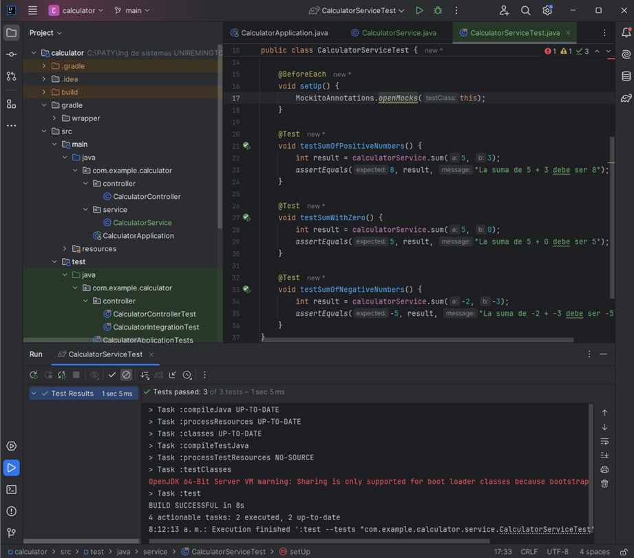
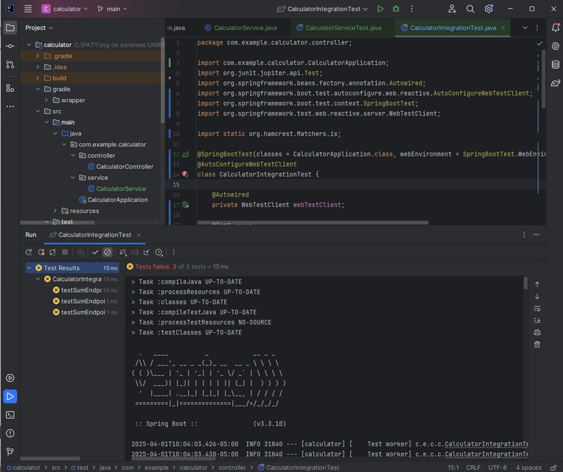
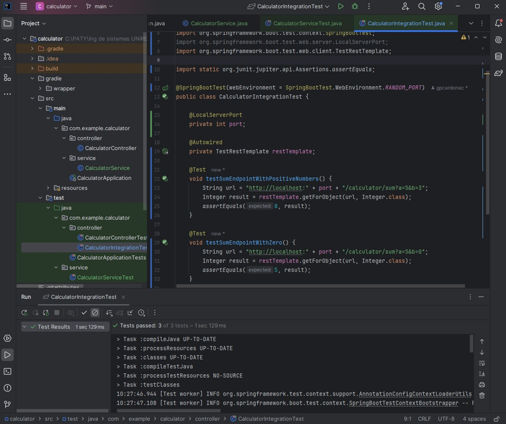
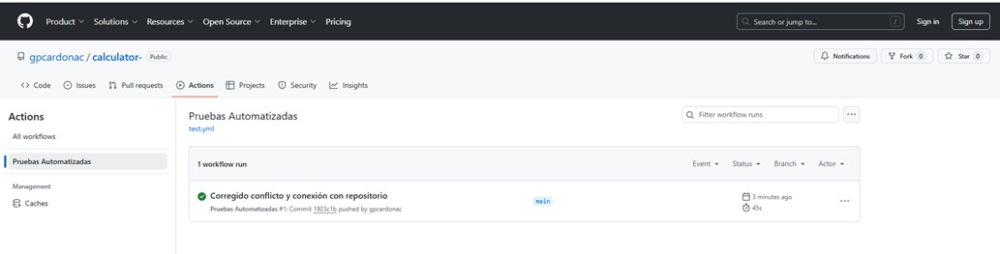

# Proyecto Calculadora - Spring Boot

#Este es un proyecto  desarrollado en Spring Boot como parte de la evaluación sobre Automatización de Pruebas y Configuración del Entorno.

## 📌 Descripción

#La aplicación expone un endpoint REST que permite sumar dos números enteros mediante parámetros `a` y `b`.

**Endpoint:**  
```
GET /calculator/sum?a=2&b=3
```
**Respuesta:**  
```
5
```

---

## ⚙️ Tecnologías utilizadas

- Java 17
- Spring Boot 3.3.10
- Gradle
- JUnit 5
- MockMvc (para pruebas de integración)

---

## 🧪 Pruebas Automatizadas

Se implementaron:

- ✅ Dos pruebas unitarias en `CalculatorControllerTest`
- ✅ Una prueba de integración en `CalculatorIntegrationTest`

Las pruebas pueden ejecutarse con:

```
./gradlew test
```

---
### Pruebas Unitarias



Método probado	Descripción	Resultado esperado
sumar(5, 3)	Suma de dos números positivos	8
sumar(5, 0)	Suma de un número con cero	5
sumar(-2, -3)	Suma de dos números negativos	-5
Estas pruebas son ejecutadas automáticamente por el pipeline de GitHub Actions al realizar cualquier push a la rama main, gracias a la configuración incluida en el archivo test.yml.


### Pruebas de Integración



Se implementaron tres pruebas unitarias usando Mockito en el archivo CalculatorServiceTest.java, simulando el comportamiento del servicio:

Se implementaron tres pruebas de integración en el archivo CalculatorIntegrationTest.java, verificando el correcto funcionamiento del endpoint /calculator/sum a través de solicitudes reales usando TestRestTemplate.

Endpoint llamado	Descripción de la prueba	Resultado esperado
GET /calculator/sum?a=5&b=3	Suma de dos números positivos	8
GET /calculator/sum?a=5&b=0	Suma de un número y cero	5
GET /calculator/sum?a=-2&b=-3	Suma de dos números negativos	-5
Estas pruebas permiten validar el comportamiento de la API como si fueran peticiones externas reales, asegurando que la integración entre el controlador y el servicio funciona correctamente.
También son ejecutadas automáticamente en el pipeline de GitHub Actions.


## 📂 Estructura del proyecto

```
src/
├── main/
│   └── java/com/example/calculator/controller/CalculatorController.java
└── test/
    └── java/com/example/calculator/controller/
        ├── CalculatorControllerTest.java
        └── CalculatorIntegrationTest.java
```
---

### GitHub Actions funcionando


## 🔗 Repositorio

[Ver el proyecto en GitHub](https://github.com/gpcardonac/calculator)

